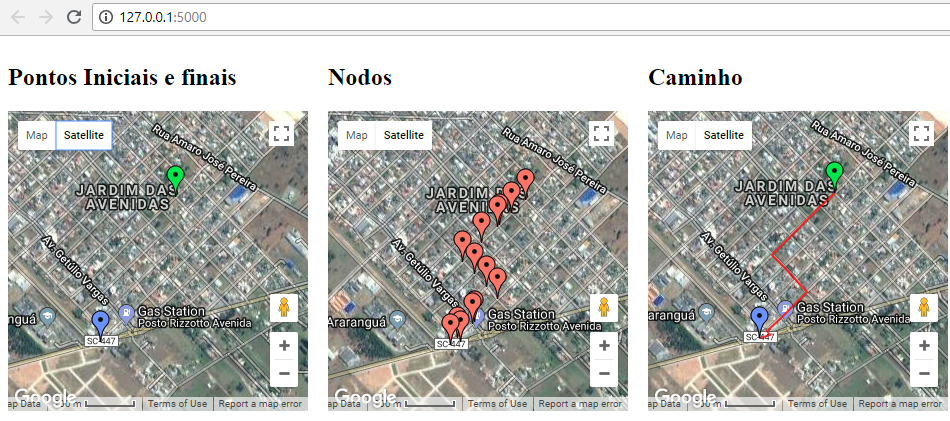

Topicos Especiais 3, Sistema de localização

    Aplicação do algorítmo de dijkstra na implementação de um sistema de localização.
    Os dados de entrada (Grafo) é obtido na plataforma OpenStreetMaps.
    Para adicionar seu proprio mapa exporte um OSM e cole na pasta src, o OSM atual cobre toda a cidade de  Araranguá-SC
    Para selecionar os pontos iniciais altere no construtor da classe no arquivo tratamento.py, substitua os pontos pelo 
    id dos pontos no formato OSM.

        self.inicial = '1942043262'
        self.final = '5451630914'

BACKEND:
    No arquivo tratamento.py é calculado o algorítmo e encontrado o menor caminho, também foram implementadas algumas
    funções adicionais para uso futuro que podem ser desconsideradas no momento.

    No arquivo plot.py ocorre a renderização dos mapas ultilizando Flask e Google Maps, para mais detalhes vide:
    https://github.com/rochacbruno/Flask-GoogleMaps
    São renderizados 3 mapas:
    Mapa 1:
     Contém primeiro contém os pontos iniciais (clicáveis).
    Mapa 2: 
     Contém marcadores em todos os notos encontrados pelo algorítmo.
    Mapa 3:
     Contem o desenho do caminho com o os pontos inicial e final.

FRONTEND:
    Para mostrar os mapas ultiliza a plataforma jinja para geração de templates html, src/templates/plot.html

    Requisitos:
    -Python 2.7
    -Jinja (pip install Jinja2)
    -Flask (pip install Flask)
    -SetupTools 
    -Google api key https://developers.google.com/maps/documentation/javascript/get-api-key
    -Networkx  (pip install networkx)
    -Python Flask google maps (pip install flask-googlemaps)

    Para rodar o programa:
        $ python setup.py develop
        $ cd src
        $ python plot.py
        running..

Após a execução a aplicação rodará em seu navegador, tal tecnica otimiza muito a aplicação. Observe que mesmo
com um mapa tão grande funciona gastando uma quantidade relativamente baixa de memoria e processamento. Você ainda pode aproveitar todos os recursos do google maps para a visualização do mapa.

